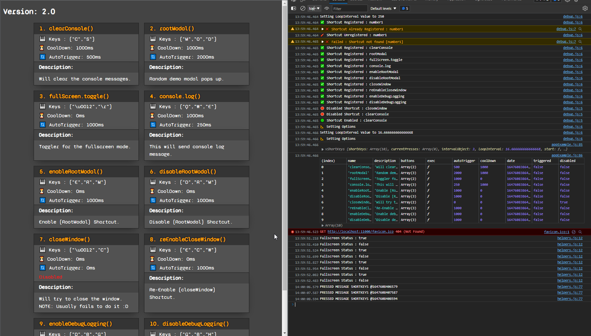

## 🎹 v_shortkeys

Simple way to have Keyboard Shortcuts with auto-triggering, cooldown times, and more.

## ALPHA VERSION : 004 ;

## ! NOT READY FOR USE !

#

### 🚀 1st Install

    npm i v_shortkeys --save

### 🔧 2nd Basic Usage

    const vShortKeys = require('v_shortkeys');
    var vsk = new vShortKeys();

    vsk.registerShortcut("number1", [49], () => console.log('YEA Demo Button 1'));

This will execute passed function when user presses key 49 which is actually "Number 1" key.

> NOTE: Number 1 on the numeric keyboard is not the same button!

---

## **📐 Additional Options:**

#### 👉 **Register New Shortcut/Key-Combo**

- _Will register a new shortcut/key-combo_

      vsk.registerShortcut(name, buttons, callback, description, autoTrigger, coolDown);

> **ARGS**:
>
> - name : String
> - buttons : Array of numbers/Keys
> - callback : Function
> - description : String
> - autoTrigger : Number / ms to wait before re-triggering
> - coolDown : Number / ms to wait before being able to trigger it again

#### 🚫 **Disable Item**

- _Will Disable a shortcut/key-combo by Name as String._

       vsk.disableShortcut( name );

#### 🟢 **Enable Item**

- _Will Enable a shortcut/key-combo by Name as String._

      vsk.enableShortcut( name );

#### 🌀 **Change Loop Interval**

- _Set the loop interval time in milliseconds as number._

      // Default: (1000 ms / 60) => 60hz
      vsk.setOption({ interval : 10 });

#### 🌀 **Enable Debug Logging**

- _Enable logging to console for debug._

      vsk.setOption({ debug : true });

---

## 👷‍♂️ **Extended Example Use**

    const vShortKeys = require('v_shortkeys');
    var vsk = new vShortKeys();

    //* Enable Debugging and Extend Interval to super long time. Less looping.
    vsk.setOption({ debug: true, interval: 250 });

    //* vShortKeys.registerShortcut(name, buttons, callback, description, autoTrigger, coolDown)
    vsk.registerShortcut("clearConsole", [67, 83], clearConsole, "[c + s] \n Will clear the console messages.", 500, 1000);
    vsk.registerShortcut("rootModal", [77, 79, 68], toggleRootModal, "[m + o + d] \n Random demo modal pops up.", 2000, 1000);
    vsk.registerShortcut("fullScreen.toggle", [18, 13], fullScreen.toggle, "[alt + enter] \n Toggler for the fullscreen mode.", 1000, 0);
    vsk.registerShortcut("console.log", [81, 87, 69], messageConsoleDemo, "[q + w + e] \n This will send console log message.", 250, 1000);

Additional Screenshot From The Example:

---

📑 Related links :

- [v_to_md5](https://www.npmjs.com/package/v_to_md5) ⏭ MD5 hash generator
- [v_to_sha256](https://www.npmjs.com/package/v_to_sha256) ⏭ sha256 hash generator
- [v_file_system](https://www.npmjs.com/package/v_file_system) ⏭ simple and safe fs module with sync and promises
- [v_execute](https://www.npmjs.com/package/v_execute) ⏭ Exec cli commands
- [v_scrolls](https://www.npmjs.com/package/v_scrolls) ⏭ Readme Generator
- [v_database](https://www.npmjs.com/package/v_database) ⏭ single database solution
- [v_database_cli](https://www.npmjs.com/package/v_database_cli) ⏭ v_database cli tool
